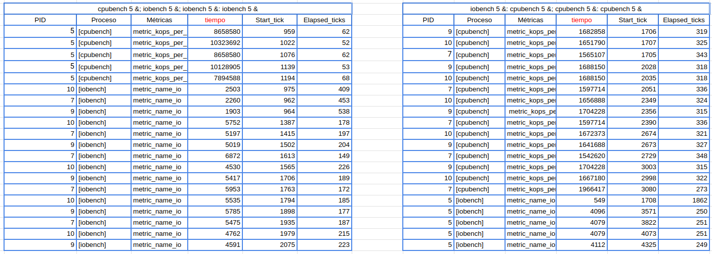
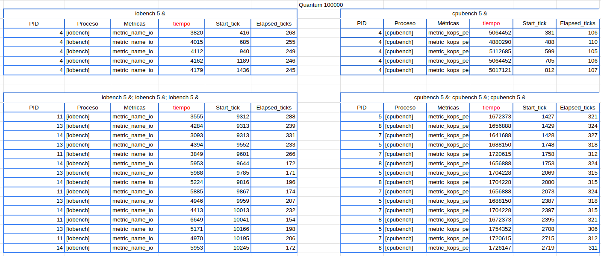
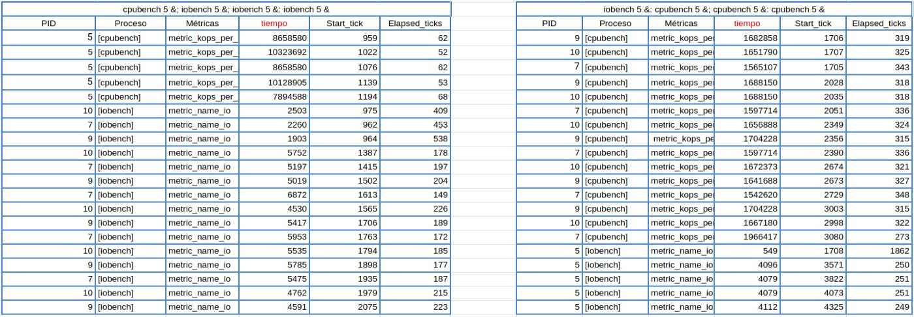
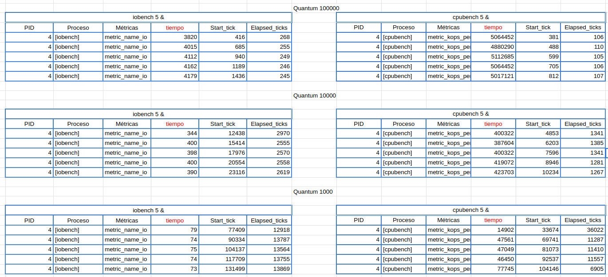

# LABORATORIO N°3, GRUPO 14

## Informe de Análisis: 

## PARTE 1: PREGUNTAS SOBRE xv6-riscv

### 1- Qué política de planificación utiliza xv6-riscv para elegir el próximo proceso a ejecutarse?

xv6-riscv utiliza la politica de planificacion Round Robin (RR) para elegir el pròximo proceso a ejecutarse, esto quiere decir que a cada proceso se le asigna cíclicamente una ranura de tiempo fija para ejecutarse. En este caso esto ocurre dentro de la funcion scheduler (su implementacion se encuentra dentro de proc.c) en donde se recorre una lista de procesos (proc[NPROC]) preguntando si un proceso esta disponible para ejecutarse (RUNNABLE) para pasar a ejecutarse (RUNNING) un tiempo determinado (ver pregunta 3) antes de de volver a tabla de procesos de donde se seleccionan los procesos a ejecutar. Cabe aclarar que es luego de hacer el cambio de estados de RUNNABLE a RUNNING que se hace el cambio de contexto (ver pregunta 4).


### 2- Cúales son los estados en los que un proceso puede permanecer en xv6-riscv y qué los hace cambiar de estado?

Los estados estan declarados en proc.h y son UNUSED, USED, SLEEPING, RUNNABLE, RUNNING, ZOMBIE, y estos cambian de la siguiente forma:

### UNUSED:
Cambia a **USED** cuando se crea un nuevo proceso (por ejemplo, mediante una llamada a fork()), se asigna una entrada en la tabla de procesos, y su estado cambia a USED mediante la llamada a la funcion allocproc().

### USED:
Cambia a **RUNNABLE** cuando un proceso está listo para ser ejecutado. Esto ocurre cuando:
- Se llama a **fork()** y el proceso está preparado para comenzar su ejecución.
- Un proceso que finaliza su ejecución (se vuelve ZOMBIE) es recogido por su padre, liberando su entrada y permitiendo que se use nuevamente, esto ocurre cuando se llama a la funcion **exit()**.

### RUNNABLE:
- Cambia a **RUNNING** cuando es elegido por el planificador (en la función scheduler()) para ser ejecutado.
- Cambia a **SLEEPING** cuando se realiza una llamada que requiere esperar (por ejemplo, sleep() o wait()).

### RUNNING:
- Cambia a **RUNNABLE** cuando un proceso cede voluntariamente el control (por ejemplo, mediante yield()), o cuando se interrumpe por una señal (como un timer).
- Cambia a **SLEEPING** si el proceso se bloquea esperando un evento (por ejemplo, un evento de entrada/salida).

### SLEEPING:
Cambia a **RUNNABLE** cuando el evento por el que el proceso estaba durmiendo ocurre (por ejemplo, un evento de entrada/salida completado). También puede cambiarse a RUNNABLE si se recibe una señal de kill().

### ZOMBIE:
Cambia a **UNUSED** cuando ha terminado su ejecución pero su entrada todavía está presente para que el proceso padre la recoja. Una vez que el padre llama a wait(), el proceso puede ser reciclado y su estado cambia a UNUSED.

La implementacion de los cambios de estado puede verse principalmente en **proc.c**


### 3- ¿Qué es un *quantum*? ¿Dónde se define en el código? ¿Cuánto dura un *quantum* en `xv6-riscv`?

Un quantum es una **porcion de tiempo de CPU** que se le asigna a cada proceso para ejecutarse en un sistema de planificación Round Robin.
En nuestro código esta definido en la funcion timerinit() en start.c como la variable **interval**, y dura 1 millon de ciclos o 1/10 de segundo en qemu.


### 4- ¿En qué parte del código ocurre el cambio de contexto en `xv6-riscv`? ¿En qué funciones un proceso deja de ser ejecutado? ¿En qué funciones se elige el nuevo proceso a ejecutar?

El cambio de contexto en `xv6-riscv` ocurre principalmente en el archivo **proc.c** (específicamente en las funciones scheduler(), y sched()), que es donde se gestionan los procesos y la planificación de los mismos. Además, son muy importantes también los archivos swtch.S y trap.c, ya que en el primero es donde se define la función swtch (en assembly), que se encarga de guardar el contexto del proceso que está saliendo, y carga el contexto del nuevo proceso que va a ejecutarse. En cuanto al segundo, trap.c, también es muy significativo para el cambio de contexto, esto se debe a que en él se manejan las interrupciones y llamadas al sistema. En particular hay 3 funciones que facilitan este cambio de contexto que son: usertrap(), usertrapret(), y kerneltrap().


| FUNCION          | DESCRIPCION                   |
| ------------- 		 | ------------------------------ |
| **`yield()`**      | Cuando un proceso llama a yield(), **cede voluntariamente** el control del CPU, provocando que scheduler() seleccione un nuevo proceso.|
| **`exit()`**   | Termina la ejecución del proceso y lo deja en estado **zombie** hasta que el padre llame a wait().|
| **`sleep() y wait()`** | Cuando un proceso realiza operaciones de entrada/salida o intenta leer un recurso que **no está disponible**, cambia su estado a sleeping o blocked dejando de ejecutarse, hasta que el recurso esté disponible, o se reciba una señal.|
| **`usertrap() y kerneltrap()`** | Cuando ocurre una **interrupción** porque se acabó el tiempo de ejecución del proceso.|


El nuevo proceso a ejecutar es elegido en la función **scheduler()** en el archivo proc.c, examina los procesos listos y decide cuál debe ser el siguiente en recibir tiempo de CPU.

### 5- ¿El cambio de contexto consume tiempo de un *quantum*?

El cambio de contexto **sí** consume tiempo del quantum, ya que, como vimos en una de las preguntas de arriba, en un cambio de contexto, el sistema operativo se encarga de guardar el estado del proceso actual, y carga el estado del próximo a ejecutar. Como sabemos, el cambio de contexto en xv6-riscv ocurre en la función swtch del archivo swtch.S, y en el mismo hay 28 instrucciones que tienen que ser ejecutadas por el procesador, por lo tanto, en el proceso de guardar y cargar el contexto, **se consume un tiempo**, generalmente muy pequeño en comparación con la duración de un quantum, pero que sigue siendo parte del quantum.

## PARTE 2: MÉTRICAS

### Primer experimento

### 1. Describa los parámetros de los programas cpubench e iobench para este experimento (o sea, los define al principio y el valor de N. Tener en cuenta que podrían cambiar en experimentos futuros, pero que si lo hacen los resultados ya no serán comparables).


| PARAMETRO          | DESCRIPCION                   |
| ------------- 		 | ------------------------------ |
| **`CPU_MATRIX_SIZE`**      | Es llamado en la funcion cpu_ops_cycle() y es utilizado para definir el **tamaño de las matrices** que se utilizan alli. En este caso, como el valor del parámetro es 128, las matrices A, B y C seràn de dimensiones 128x128. Por su parte, el tamaño de estas matrices afecta la cantidad de operaciones de multiplicación y suma que se realizan dentro de dicha función.|
| **`CPU_EXPERIMENT_LEN`**   | Es llamado en la misma funcion mencionada anteriormente y se encarga de definir cuantas veces se **repetirá el ciclo** de multiplicación de matrices (el segundo "for loop" dentro de la función). Debido a que en nuestro codigo el parámetro toma el valor 256, dicho ciclo se reperirá 236 veces. Al aumentar los numeros de càlculos realizados tambien cumple la funciòn de controlar la duracion del experimento, aumentando el numero de càlculos realizados.|
| **`MEASURE PERIOD`** | En lo referido a la instrucción cpubench, tenemos el parametro MEASURE_PERIOD con valor de 1000 **no usado** en este codigo. Este parámetro podría usarse para definir un intérvalo de medición con la que tomar medidas de rendimiento. Sin embargo, al elaborar nuestra métrica no vimos necesario utilizar dicho parametro.|
| **`IO_OPSIZE`** | Toma el valor de 64 y se encarga de definir el tamaño, en bytes, de los **bloques de datos** que se escriben y leen durante cada operación de entrada y salida. Al estar en 64 bytes, cada vez que se ejecuta una operación de escritura o lectura se estan escribiendo o leyendo bloques de 64 bytes. |
| **`IO_EXPERIMENT_LEN`** | De forma similar al cpu_experiment_len visto anteriormente, se encarga de de definir **cuantas veces** se ejecutará la operación de escritura y lectura de archivos. En este caso, debido a que el valor que toma es 512, se realizan 512 escrituras y 512 lecturas. De esta forma se acaba controlando la duración del experimento, ya que a mayor valor mas tiempo se ejecutarán las operaciones.|
| **`N`** | Por último, en lo que refiere al parametro **N**, este es utilizado por ambas instrucciones (CPUBENCH e IOBENCH) y se encarga de determinar cuantas veces se ejecuta cada instrucción al llamarla. En nuestro caso el valor que este toma es 5. |

### 2. ¿Los procesos se ejecutan en paralelo? ¿En promedio, qué proceso o procesos se ejecutan primero? Hacer una observación cualitativa.



#### Los procesos se ejecutan en paralelo?
Como ejecutamos xv6 con 1 CPU, no es posible que haya paralelismo. Sin embargo, se produce una ilusión de paralelismo ya que el sistema operativo va intercalando entre los procesos en ejecución rapidamente. Esto último lo concluímos de nuestra tabla, ya que hay procesos que tienen **start_tick** similares.

#### En promedio, qué proceso o procesos se ejecutan primero? 
En promedio, **cpubench** suele acabar antes que iobench porque solo requiere recursos de la CPU. Por otro lado, **iobench** realiza operaciones de lectura/escritura, lo que agrega tiempos de espera, que consiste en el tiempo apertura y cierre de archivos, entre otros recursos de entrada/salida además de recursos de cpu.

#### Hacer una observacion cualitativa
Podemos ver como **cpubench** está enfocado en operaciones intensivas de cálculo (sumas y multiplicaciones en matrices de 128*128*128) y no sufre demoras externas ya que, a diferencia de los procesos iobound, este no requiere recursos de E/S mientras que **iobench** al realizar operacion de entrada/salida requiere abrir y cerrar archivos, por lo que, si bien es ínfimo, suele demorar más.


### 3. ¿Cambia el rendimiento de los procesos iobound con respecto a la cantidad y tipo de procesos que se estén ejecutando en paralelo? ¿Por qué?

Al realizar este experimento podemos ver que hay una caida importante tanto en el rendimiento de los procesos cpubound como iobound. Esta reduccion en el rendimiento del iobound se puede ver cuando se ejecutan procesos iobound y cpubound al mismo tiempo como "iobench 5 &: cpubench 5 &; cpubench 5 &: cpubench 5 &". Al ejecutarse procesos de ambos tipos ocurre que mientras se ejecutan los procesos iobench se estan ejecutando al mismo tiempo todos los procesos cpubound. Esto se puede observar en los start_tick y elapsed_tick. Podemos ver que la primera ejecucion de iobound comienza en el tick 1708 y demora en terminar de ejecutarse 1862 ticks. Por otro lado, el primer proceso cpubound comienza a ejecutarse en el tick 1706 y el ultimo termina en el tick 3353. De esta forma se puede ver que mientras se ejecuta el primer proceso iobound se ejecutan todos los procesos cpubound y como el proceso iobound tambien necesita recursos de cpu ve comprometido su rendimiento. Sin embargo una vez que termina de ejecutarse el ultimo proceso cpubound su rendimiento se duplica, pasando de 1708 operaciones por unidad de tiempo a 3571. Lo señalado aqui puede observarse en los cuadros del punto siguiente.

### 4. ¿Cambia el rendimiento de los procesos cpubound con respecto a la cantidad y tipo de procesos que se estén ejecutando en paralelo? ¿Por qué?

En el punto anterior señalamos que hay una caida en rendimiento en ambos procesos. La caida de rendimiento de los procesos cpubound se observa en la diferencia al ejecutarlo solo y ejecutarlo en paralelo (observando la misma ejecucion del punto anterior) ya que al ejecutarse sòlo (cpubench 5 &)rinde alrededor de los 5M de operaciones por unidad de tiempo mientras que al ejecutarse en paralelo con los procesos iobound su rendimiento cae a los 1.5M de operaciones. La razon es la misma que la señalada anteriormente. Mientras todos los procesos cpubound se ejecutan se esta ejecutando un proceso iobound que tambien consume recursos de cpu, por lo que los procesos que solo dependen de este ven su rendimineto drasticamente reducido. Ahora, la caida en rendimiento no solo ocurre cuando llamamos en paralelo procesos de cpubound e iobound. Dicha caida tambien se observa cuando llamamos a varios procesos cpubound al mismo tiempo (cpubench 5 &: cpubench 5 &; cpubench 5 &). Al llamar a estos procesos estos se ejecutan simultaneamente, ya que podemos observar que los PID 5, 8 y 7 empiezan en los start tick 1427, 1429 y 1428 respectivamente, y demoran en ejecutarse 321, 324 y 327 ticks. Esto causa que los recursos de cpu se repartan entre los tres procesos reduciendo el rendimiento de cada una mas de 3 veces.





### 5. ¿Es adecuado comparar la cantidad de operaciones de cpu con la cantidad de operaciones iobound?

Habiendo analizado las situaciones para las que podría ser util utilizar una comparación de la cantidad de operaciones cpubound e iobound, llegamos a la conclusión de que no sería adecuado debido a dos razones. La primera consiste en que, si quisieramos solo comparar la cantidad de operaciones de ambos procesos esto no tendria mucho sentido ya que por los parámetros presentes en los archivos iobench.c y cpubench.c ya sabemos cuantas son las operaciones que se ejecutan en cada caso. Las operaciones iobound que se ejecutan son 1024 y las operaciones cpubound son 536870. A su vez, si se tomaran la cantidad de operaciones para, de alguna forma, tratar de comparar el rendimiento de cada tipo de operación tampoco tendria sentido ya que de entrada las operaciones iobound son mas lentas o (mejor dicho) realizan menos operaciones por tick, ya que además del cpu necesitan recursos de E/S que añaden un tiempo de demora a su ejecución, algo que no ocurre con los procesos cpubound.


### Segundo experimento

### 1. ¿Fue necesario modificar las métricas para que los resultados fueran comparables? ¿Por qué?

En nuestro caso realizamos el experimento 1 con unas métricas que, al momento de iniciar con el experimento 2, nos sorprendió el observar que los valores de cpubench se habian achicado mientras que los de iobench quedaban directamente en 0. Esto se debió a que, al achicar los quantums, se realizaban menos operaciones dando un valor muy pequeño al ser divididas por el valor de elapsed_ticks. Por esta razón nos encontramos obligados a hacer un **cambio de métricas**, esto lo hicimos de tal manera que funcione tanto para el experimento **1 y 2**. De esta forma se nos facilitó hacer una comparación entre los resultados obtenidos en el primer experimento y el actual.

### 2. ¿Qué cambios se observan con respecto al experimento anterior? ¿Qué comportamientos se mantienen iguales?

Como mencionamos en la pregunta anterior, los cambios notados con respecto al primer experimento son que, a medida que hacíamos más chico el largo del quantum, los valores tanto de cpubench como los de iobench se hacían más **pequeños**, esto quiere decir que el tiempo medido por nuestra métrica se hacía más chico, y por otro lado, el valor de la cantidad de ticks transcurrido (elapsed_ticks) incrementaba bastante. Sin embargo tambien hay comportamientos que parecieran **mantenerse iguales**, estos consisten en los procesos que se realizan en paralelo, ya que no hay variación en la forma en que los procesos se ejecutan de dicha manera al realizar los mismos llamados que se hacian en el experimento 1. A su vez, tambien se observa que al achicar los quantum se sigue respetando el hecho de que los procesos de cpubench **se ejecutan antes** que los procesos de iobench. Estos cambios y similitudes pueden observarse en el cuadro siguiente.



### 3. ¿Con un quantum más pequeño, se ven beneficiados los procesos iobound o los procesos cpubound?

**iobench 5 &**: No hubo grandes diferencias  
**cpubench 5 &**: No hubo grandes diferencias  
**iobench 5 &; iobench 5 &; iobench 5 &**: No hubo grandes diferencias  
**cpubench 5 &; cpubench 5 &; cpubench 5 &**: No hubo grandes diferencias  
**iobench 5 &; cpubench 5 &; cpubench 5 &; cpubench 5 &**: El iobench se ejecuta al final(normal), pero las métricas dan un poco por debajo de lo normal. El cpubench se ejecuta al principio(normal), pero las métricas dan considerablemente mas grande que de lo normal.  
**cpubench 5 &; iobench 5 &; iobench 5 &; iobench 5 &**: El iobench se ejecuta al final(normal), pero las métricas al principio dan bastante por debajo de lo normal aunque luego suben un poco pero siguiendo debajo de la media. El cpubench se ejecuta al principio(normal), y las métricas dan normal.    

Por esto, concluyo que los procesos cpubound son los que se ven **beneficiados** con un quantum más pequeño, ya que la medida que da nuestra métrica en general se achica para los iobound, mientras que en los cpubound se mantiene o se agranda, lo cual es mejor ya que significa mas operaciones por unidad de tiempo.

### COMO IMPLEMENTAMOS MLFQ EN XV6-RISCV

Comenzamos en el archivo **proc.h**, agregando los siguientes campos al struct proc:

```C
  int selected;                
  enum priority prio;          
```
**int selected** representa la cantidad de veces que el planificador ha elegido el proceso y **enum priority** es: 

```C
enum priority { LOW = 0, MEDIUM = 1, HIGH = NPRIO-1 };
```

Con esto ya podemos trabajar de una manera más concreta a la hora de implementar todas las reglas correspondientes al planificador MLFQ.

Luego nos fuimos a **proc.c** para modificar la manera en la que se **gestionan** los procesos en base a los nuevos campos de su estructura

En la función **allocproc** agregamos:
```C 
  p->selected = 0;
  p->prio = HIGH;
```
Inicializamos la cantidad de veces que ha sido seleccionado el proceso (es decir, ninguna)
Luego, seteando la prioridad de este nuevo proceso como la máxima, estamos cumpliendo con la **regla 3** de MLFQ
> **MLFQ regla 3**: Cuando un proceso se inicia, su prioridad será máxima.


Luego en **scheduler**:
```C
struct proc *selected_proc = 0;

for(p = proc; p < &proc[NPROC]; p++) {
  if (selected_proc == 0 || p->prio > selected_proc->prio) {
    if (selected_proc != 0) {
      release(&selected_proc->lock);
    }
    selected_proc = p;
    } else {
        release(&p->lock);
    }

if (selected_proc != 0) {
  selected_proc->selected += 1;
  selected_proc->state = RUNNING;
  c->proc = selected_proc;
  swtch(&c->context, &selected_proc->context);
  c->proc = 0;
  release(&selected_proc->lock);

```
En este fragmento de código extraído de la función **scheduler**, podemos ver como el blucle **for** itera sobre los procesos a ejecutar, quedándose con el que **mayor prioridad** tiene, esto cumple con la **regla 1** de MLFQ
> MLFQ regla 1: Si el proceso A tiene mayor prioridad que el proceso B, corre A. (y no B)  

En el condicional de abajo aumentamos el campo **selected** del proceso ya que ha sido seleccionado, pasamos su estado a **RUNNING** y realizamos el **cambio de contexto** de c a selected_proc.

Luego en **trap.c**
```C
if(which_dev != 2) {
    if(p->prio == LOW){
      p->prio = MEDIUM;
    }  else if(p->prio == MEDIUM){
      p->prio = HIGH;
    }

if(which_dev == 2){
    if(myproc()->prio == HIGH){
      myproc()->prio = MEDIUM;
    } else if(myproc()->prio == MEDIUM){
      myproc()->prio = LOW;
    }
``` 
Aquí, en la función **usertrap** (que maneja las interrupciones), aumentamos su prioridad si el proceso recibe una interrupción antes de terminar su **quantum**. 
También, disminuímos la prioridad si es que se realiza una interrupción por temporizador usando **which_dev == 2** como condicional, es decir si el tiempo de CPU asignado para tal proceso ya terminó.
Colocamos el mismo algoritmo en la función **kernel_trap**.

Con esto cumplimos la **regla 4** de MLFQ
> MLFQ regla 4: Descender de prioridad cada vez que el proceso pasa todo un quantum realizando cómputo. Ascender de prioridad cada vez que el proceso se bloquea antes de terminar su quantum.


Para implementar la **regla 2** volvimos a la función **scheduler**
```C
else if(p->prio == selected_proc->prio && p->selected < selected_proc->selected){
  if (selected_proc != 0) {
    release(&selected_proc->lock);
  }
    selected_proc = p;
```
Agregando este condicional dentro del bucle **for** nos aseguramos de que si dos procesos tienen la misma prioridad, se ejecuta el que **menos veces ha sido seleccionado**, con esto cumplimos la **regla 2**

> MLFQ regla 2: Si dos procesos A y B tienen la misma prioridad, corre el que menos veces fue elegido por el  planificador.


También agregamos una forma de ver la cantidad de veces que cada proceso ha sido seleccionado en la función **procdump***
```C
printf("ESTADO: %s      PRIORIDAD de %s: %d         VECES SELECCIONADO: %d\n", state, p->name, p->prio, p->selected)
```

Con esto finalizamos con la implementación del sistema de planificación **MLFQ** dentro del sistema operativo **xv6-riscv**.